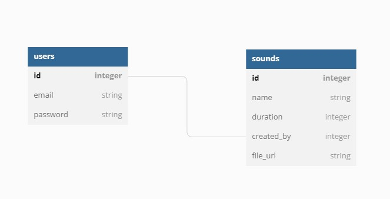

# DESAFIO TECH - ME SALVA!

## Tabela de Conteúdos
  * [Estrutura de Dados](#estrutura-de-dados)
  * [Paradigmas](#paradigmas)
  * [Ruby](#ruby)
  * [Rails](#rails)
  * [Autenticação](#autenticação)

## Estrutura de Dados

A estrutura de dados com as tabelas e campos utilizados neste projeto estão detalhados no diagrama de dados a seguir:

## Paradigmas

O projeto está desenvolvido em estrutura MVC com paradigma orientado à objetos.

## Ruby

O projeto utiliza a linguagem Ruby na versão 3.1.2.

## Rails

O projeto utiliza a framework Rails na versão 7.0.3.1

## Autenticação

Foi criada uma autenticação simples que verifica se o email e senha informados na requisição existem no banco de dados.

Create by [Tiago Zanarde](https://tiagozanarde.dev).
